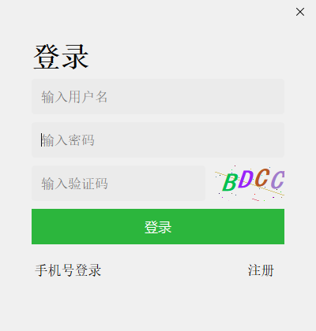
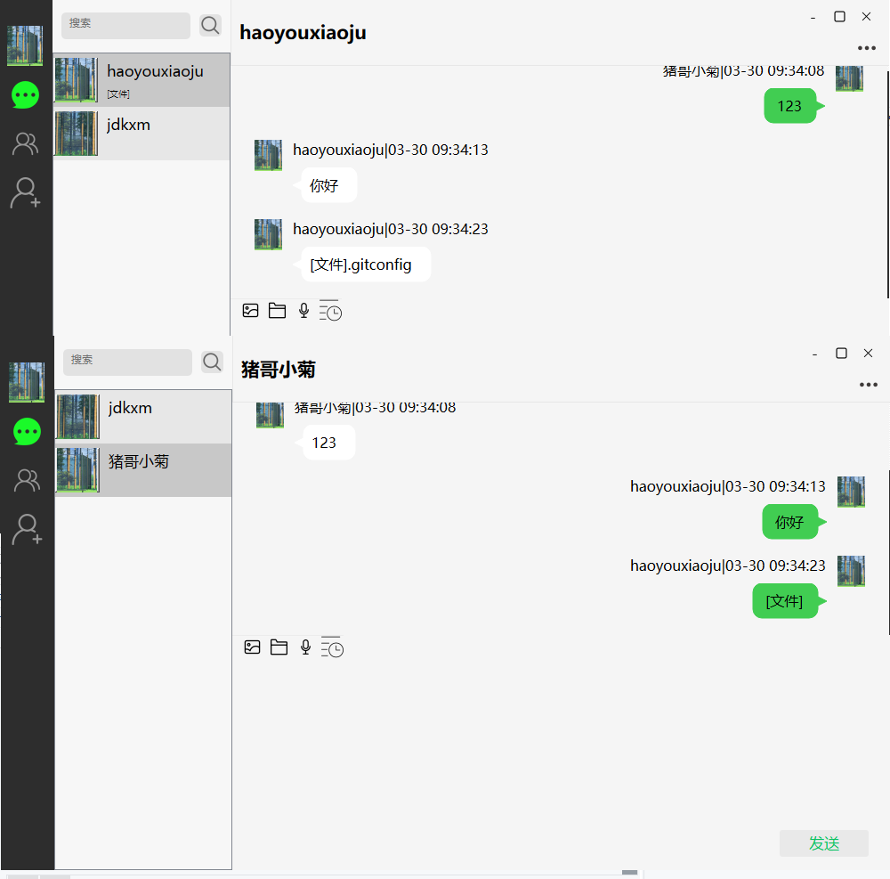

# myChat

***项目概述:***	本项目是使用qt编写的简单聊天室,能够完成基础的聊天功能,例如:消息和文件的发送和接收以及获取历史聊天记录、搜索添加删除好友以及创建群聊、修改用户个人头像和昵称等信息。

***主要实现：***

1. 使用QtWidget构建出和电脑端微信类似的用户界面，涵盖主界面、聊天窗口、好友列表等界面
2. 将前后端交互数据序列化为protobuf格式并发送给服务器
3. 采用QtNetwork达成前后端的连接，具体使用QTcpSocket或者QUdpSocket进行网络通信
4. 对接受的数据通过一个单例的数据中心类进行保存，用于保存用户、好友和聊天会话列表等信息
5. 在界面设计中使用了单例模式来方便在不同界面间获取需要关联的类，同时使用了简单工厂模式完成类型一致的参数根据不同值创建需要的类

登录界面:(一共只有用户名登录\手机验证码登录\手机注册)

主界面

